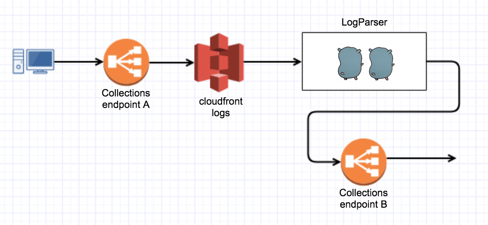

## LogParser

When hooked to s3 PUT events on a Lambda, it reads
the new key, generating GET requests to the given endpoint with the query string and parameters obtained from the S3 log.



### Configuration

Set the following environment variables:

- ```ENDPOINT```=http://sandbox-cloudapi.imrworldwide.com/
- ```MAX_REQUESTS```=1000
- ```MAX_WORKERS```=500


### Installing

- ```make clean package```  create zip file with go executable
- ```make create-function``` creates lambda function (run it once)
- ```make redeploy``` updates package (go executable)
- ```make update``` updates lambda metadata


